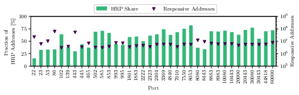
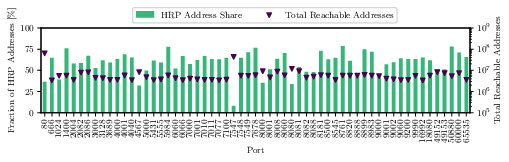
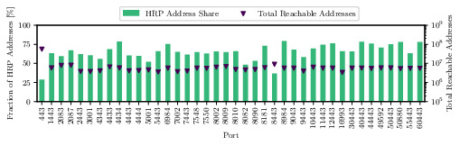
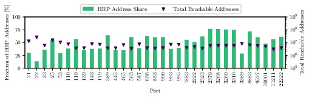
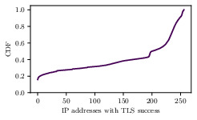
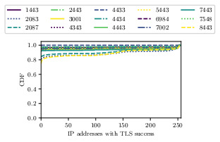
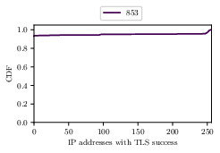
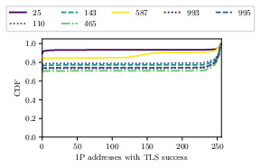
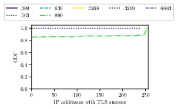

# Packed to the Brim: Analyzing Highly Responsive Prefixes on the Internet

Authors: Patrick Sattler, Johannes Zirngibl, Mattijs Jonker, Oliver Gasser, Georg Carle, and Ralph Holz

Published in the Proceedings of ACM Networking (CoNEXT3) - https://doi.org/10.1145/3629146

You can either use our [tool](#hrp-analysis-tool) or download the latest HRPs with our [utility.](#utilities)

## HRP Analysis Tool

The [tool]({{site.url}}/search-for-hrps.py) to search for highly responsive prefixes inside port scans provides the following parameters:

```
usage: Parse zmap output and return high responsive prefix information [-h]
  [--scan_port SCAN_PORT] [--scan_date SCAN_DATE] [--scan_location SCAN_LOCATION]
  [-o OUTPUT_DIR] [--pyasn-file PYASN_FILE] [--headers-included] input_file

positional arguments:
  input_file            zmap file

options:
  -h, --help            show this help message and exit
  --scan_port SCAN_PORT
                        Port or service which has been scanned
  --scan_date SCAN_DATE
                        Date of the port scan
  --scan_location SCAN_LOCATION
                        Location of the port scan
  -o OUTPUT_DIR, --output-dir OUTPUT_DIR
                        Output directory
  --pyasn-file PYASN_FILE, -p PYASN_FILE
                        Path to pyasn file
  --headers-included, -t
                        Set this flag if headers are included
```

The Python module requirements can be installed using `pip install -r requirements.txt`.

The input file must only contain IP addresses and be sorted by the addresses.
We provided an exemplary command which can be used to feed your unsorted zmap file to our tool:

```
cut -d, -f ${ip_address_column} ${zmap_file} | \
  tail -n +2 | \
  sort -n -t . -k 1,1 -k 2,2 -k 3,3 -k 4,4 -S10% -T /tmp --compress-program=lz4 | \
  tee ${zmap_file}.sorted | \
  python search-for-hrps.py -p ${pyasndat_file} --scan-port ${scan_port} \
      --scan-date ${scan_date} --scan-location ${scan_location} -o ${output_dir} -
```

The pyasn file as well as scan port, date, and location are optional parameters.
Omit the `tail -n +2` part if your file does not contain a header.
You can also omit the tee command if you do not need the intermediate sorted file.
This intermediate file can also be used directly by the python script as input file.

## Utilities

The [get-hrps.py]({{site.url}}/get-hrps.py) script can download the latest port 80 and 443 HRPs for your convenience.

```
usage: Downloads latest HRP file (by default port 443 can be changed with http flag [-h] [--http] -o OUTPUT_DIR

options:
  -h, --help            show this help message and exit
  --http                Download port 80 HRPs
  -o OUTPUT_DIR, --output-dir OUTPUT_DIR
                        Output directory
```

## Highly Responsive Prefixes (HRPs)

We provide weekly data on HRPs for ports 80 and 443:

- [Port 80 HRPs](https://github.com/hrp-stats/hrp-stats.github.io/tree/main/hrps/80)
- [Port 443 HRPs](https://github.com/hrp-stats/hrp-stats.github.io/tree/main/hrps/443)

A continuously updated service will be provided when anonymity is lifted.
Our [get-hrps](#utilities) utility uses these directories as source


## Abstract

Internet-wide scans are an important tool to evaluate the deployment of services.
To enable large-scale application layer scans, a fast, stateless port scan (e.g., using ZMap) is often performed ahead of time to collect responsive targets.
It is a common expectation that port scans on the entire IPv4 address space provide a relatively unbiased view as they cover the complete address space.
Previous work, however, has found prefixes where all addresses share particular properties.
In IPv6, aliased prefixes and fully responsive prefixes, i.e., prefixes where all addresses are responsive, are a well-known phenomenon.
However, there is no such in-depth analysis for prefixes with these responsiveness patterns in IPv4.

This paper delves into the underlying factors of this phenomenon in the context of IPv4 and evaluates port scans on a total of 161 ports (142 TCP & 19 UDP ports) from three different vantage points.
To account for packet loss and other scanning artifacts, we propose the notion of a new category of prefixes, which we call highly responsive prefixes (HRPs).
Our findings show that the share of HRPs can make up 70 % of responsive addresses on selected ports.
Regarding specific ports, we observe that CDNs contribute to the largest fraction of HRPs on TCP/80 and TCP/443, while TCP proxies emerge as the primary cause of HRPs on other ports.
Our analysis also reveals that application layer handshakes to targets outside HRPs are, depending on the chosen service, up to three times more likely to be successful compared to handshakes with targets located in HRPs.
To improve future scanning campaigns conducted by the research community, we make our study’s data publicly available and provide a tool for detecting HRPs.
Furthermore, we propose an approach for a more efficient, ethical, and sustainable application layer target selection.
We demonstrate that our approach has the potential to reduce the number of TLS handshakes by up to 75 % during an Internet-wide scan while successfully obtaining 99 % of all unique certificates.


## Hilbert Curves

We generated hilbert curves for all ports scanned (During August 2022).
We provide two variants:
- All responsive addresses with their denseness
- Only HRPs are colored

Find all hilbert curves [here.](https://github.com/hrp-stats/hrp-stats.github.io/tree/main/hilbert_curves)

### TCP/443 Hilbert Curve (All Responsive Addresses)

")

### TCP/443 Hilbert Curve (HRPs only)

")

### TCP/80 Hilbert Curve (All Responsive Addresses)

Port scan by Rapid7

")

### TCP/80 Hilbert Curve (HRPs only)

Port scan by Rapid7

")

## Full Port comparisons

### Comparison of ports scanned by our vantage points


### Comparison of Rapid7 HTTP ports scans


### Comparison of Rapid7 HTTPS ports scans


### Comparison of other Rapid7 ports scans


## Application Layer Validation

### Number of addresses completing a TLS handshakes on TCP/443


### Number of addresses completing a TLS handshakes for alternative TLS ports


### Number of addresses completing a TLS handshakes for DNS ports


### Number of addresses completing a TLS handshakes for mail ports


### Number of addresses completing a TLS handshakes for other ports


## Raw Data

You can find raw data and statistical exports in our published [archive.](https://mediatum.ub.tum.de/1723389)

## Contact

- [Patrick Sattler](https://www.net.in.tum.de/members/sattler) **sattler** [at] **net.in.tum.de**
